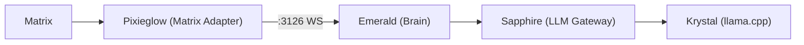

<p align="center">
  <picture>
    <source media="(prefers-color-scheme: dark)" srcset="images/logo.png">
    
  </picture>
  <h1 align="center">Pixieglow</h1>
  <p align="center">Matrix adapter for the Luna Protocol ecosystem</p>
  <p align="center">
    <a href="https://github.com/protocol-luna/pixieglow/blob/main/LICENSE">
      
    </a>
    <a href="https://www.typescriptlang.org/">
      
    </a>
    <a href="https://matrix.org/">
      
    </a>
    <a href="https://bun.sh/">
      
    </a>
    <a href="https://github.com/protocol-luna">
      
    </a>
  </p>
</p>

Pixieglow is a thin WebSocket client of **Emerald** (the brain service), forwarding Matrix messages and executing response commands. It is the Matrix counterpart of **Jade** (the Discord adapter).



## How It Works

1. Pixieglow connects to Emerald via WebSocket on port 3126
2. Pixieglow listens to Matrix room messages via the Matrix client-server API (sync loop) and forwards them to Emerald as `MessageEvent`s
3. Emerald processes the message, calls Sapphire, and sends a `RespondCommand` back
4. Pixieglow extracts `responseText` from the command and sends it to the Matrix room
5. Pixieglow handles typing indicators via `TypingCommand`

## Technical Overview

Pixieglow is **993 lines of TypeScript** across 6 source files. It runs on **Bun** and communicates with Matrix homeservers via the raw Matrix Client-Server API v3.

### Source Map

| File | Lines | Role |
|------|-------|------|
| `src/index.ts` | 1 | Bootstrap entry |
| `src/cli.ts` | 21 | CLI dispatcher (only `bot` mode) |
| `src/config.ts` | 52 | YAML + env var configuration |
| `src/matrix/client.ts` | 331 | Full Matrix Client-Server API v3 wrapper |
| `src/core/emerald-client.ts` | 230 | WebSocket client for Emerald |
| `src/core/bus.ts` | 44 | Typed event bus (unused currently) |
| `src/bot/matrix-bot.ts` | 388 | Main bot: sync loop, command execution |

### Matrix Client (`src/matrix/client.ts`, 331 lines)

A complete Matrix Client-Server API v3 wrapper using raw `fetch()` with bearer token auth. Key capabilities:

| Method | Matrix API | Purpose |
|--------|-----------|---------|
| `whoami()` | `GET /account/whoami` | Get user_id and device_id |
| `sync(since, timeout)` | `GET /sync` | Long-poll for new events (30s timeout) |
| `sendMessage(roomId, content)` | `PUT /send/m.room.message/{txnId}` | Send any message type |
| `sendText(roomId, text, replyTo?)` | -- | Send `m.text` with optional reply |
| `sendEmote(roomId, text, replyTo?)` | -- | Send `m.emote` |
| `sendReaction(roomId, eventId, emoji)` | -- | Send `m.reaction` |
| `editMessage(roomId, eventId, newBody)` | -- | Edit via `m.replace` |
| `setTyping(roomId, timeout)` | `PUT /typing/{userId}` | Show typing indicator |
| `markRead(roomId, eventId)` | `POST /read_markers` | Mark room as read |
| `getRoomMembers(roomId)` | `GET /members` | Fetch joined members |
| `joinRoom(roomIdOrAlias)` / `leaveRoom(roomId)` | -- | Room membership |
| `uploadMedia(data, mimeType)` | `POST /_matrix/media/v3/upload` | Upload files |
| `updatePresence(presence)` | `PUT /presence/{userId}/status` | Set online/offline/unavailable |

All calls use `Authorization: Bearer <MATRIX_TOKEN>`. No end-to-end encryption support.

### Sync Loop (`src/bot/matrix-bot.ts`, lines 271-338)

The core loop that keeps Pixieglow connected to Matrix:

```typescript
async function runSyncLoop(initialSince?: string): Promise<void> {
  let since = initialSince;
  while (true) {
    const sync = await client.sync(since, 30000);
    since = sync.next_batch;
    // Process state events (room name, members)
    // Process timeline events → forward to Emerald
    // Auto-join invited rooms
  }
}
```

Each iteration:
1. Long-polls Matrix `GET /sync` (blocking up to 30s)
2. Updates the sync cursor to `next_batch`
3. Processes `state.events` -- updates cached room name and member map
4. Processes `timeline.events` -- each `m.room.message` (not from self, text type) forwarded to Emerald as `MessageEvent`
5. Auto-joins invited rooms
6. On error: logs and waits 5s before retrying

The `since` token is kept **in memory only** -- a restart causes a full initial sync.

### Init Sequence (`src/bot/matrix-bot.ts`, lines 342-388)

```
startBot()
  → client.whoami()              -- get user_id and device_id
  → client.sync(null, 10000)     -- initial sync (full state, 10s timeout)
  → Process initial rooms:
      rooms.join  → fetch members, cache JoinedRoom
      rooms.invite → auto-join, fetch members, cache
  → client.updatePresence("online")
  → emerald.setUserId(botId, username)
  → emerald.connect()            -- sends ReadyEvent to Emerald
  → runSyncLoop(next_batch)      -- start incremental sync
```

### Response Execution (`src/bot/matrix-bot.ts:executeRespond()`)

```
1. Wait cmd.delay ms
2. Optionally send reaction
3. Start typing indicator (setInterval every 12s)
4. If burstPlan, split text via splitBurst()
5. Send first fragment (with hesitationWord, replyTo)
6. Schedule remaining fragments via setTimeout with cumulative delays
7. Optionally apply typoCorrection/letterSwap via editMessage()
8. Clear typing timer
```

### Burst Splitting (`splitBurst()`)

Same algorithm as Jade:
- **2 fragments:** split at random 30-55% point in word array
- **3 fragments:** split at 20-35% and 55-70%
- Short messages (<4 words) never burst

### Emerald Client (`src/core/emerald-client.ts`, 230 lines)

Same protocol as Jade. Wire format:
- `{ event: "in", payload: InEvent }` → to Emerald
- `{ event: "command", command: OutCommand }` ← from Emerald

**Commands received from Emerald:**
- `respond` -- with `responseText`, `burstPlan`, `hesitationWord`, `typoCorrection`, `letterSwap`, `react`
- `typing` -- show typing indicator for duration ms
- `set_presence` -- update Matrix presence
- `spontaneous` -- placeholder, not fully wired

### Event Types

**Pixieglow → Emerald (Inbound):**
- `MessageEvent` -- `{ type, id, client, channel, user, username, text, timestamp, isDM, debug? }`
- `ReadyEvent` -- handshake on connect
- `BotMessageEvent` -- echo of Pixieglow's own messages
- `PresenceEvent` -- presence changes

**Emerald → Pixieglow (Outbound):**
- `RespondCommand` -- full response with behavior annotations
- `TypingCommand` -- typing indicator
- `SetPresenceCommand` -- online/idle/dnd/invisible
- `SpontaneousCommand` -- trigger unbidden message

## Configuration

```yaml
matrix_homeserver: "https://matrix.exemple.com"
matrix_token: "your_matrix_access_token"
matrix_username: "pixieglow"
bot_server: "exemple.com"
emerald_host: "127.0.0.1"
emerald_port: 3126
```

The bot's Matrix ID is constructed as `@pixieglow:{bot_server}`.

## Running

```bash
# Install
bun install

# Development
bun run dev

# Production (PM2)
bun run start

# Compile standalone binary
bun run build
```
