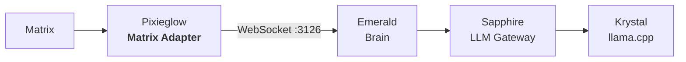

<p align="center">
  <picture>
    <source media="(prefers-color-scheme: dark)" srcset="images/logo.png">
    
  </picture>
  <h1 align="center">Pixieglow</h1>
  <p align="center">Matrix adapter for the Luna Protocol ecosystem</p>
  <p align="center">
    <a href="https://github.com/protocol-luna/pixieglow/blob/main/LICENSE">
      
    </a>
    <a href="https://www.typescriptlang.org/">
      
    </a>
    <a href="https://matrix.org/">
      
    </a>
    <a href="https://bun.sh/">
      
    </a>
    <a href="https://github.com/protocol-luna">
      
    </a>
  </p>
</p>

Pixieglow acts as a thin WebSocket client of **Emerald** (the brain service), forwarding Matrix messages and executing response commands.



## How It Works

1. Pixieglow connects to Emerald via WebSocket on port 3126
2. Pixieglow listens to Matrix room messages via the Matrix client-server API (sync loop) and forwards them to Emerald as `MessageEvent`s
3. Emerald processes the message, calls Sapphire, and sends a `RespondCommand` back
4. Pixieglow extracts `responseText` from the command and sends it to the Matrix room
5. Pixieglow handles typing indicators via `TypingCommand`

## Features

- **Emerald WebSocket client** — Thin adapter, all LLM logic delegated to Emerald
- **Matrix sync loop** — Polls the Matrix API for new messages
- **Multi-room** — Responds to all rooms the bot is in

## Configuration

Copy `config.example.yml` to `config.yml`:

```yaml
matrix:
  homeserver_url: "https://matrix.fox3000foxy.com"
  access_token: "your_matrix_access_token"
emerald_host: "localhost"
emerald_port: 3126
```

## Running

```bash
# Install
bun install

# Development
bun run dev

# Production (PM2)
bun run start
```
